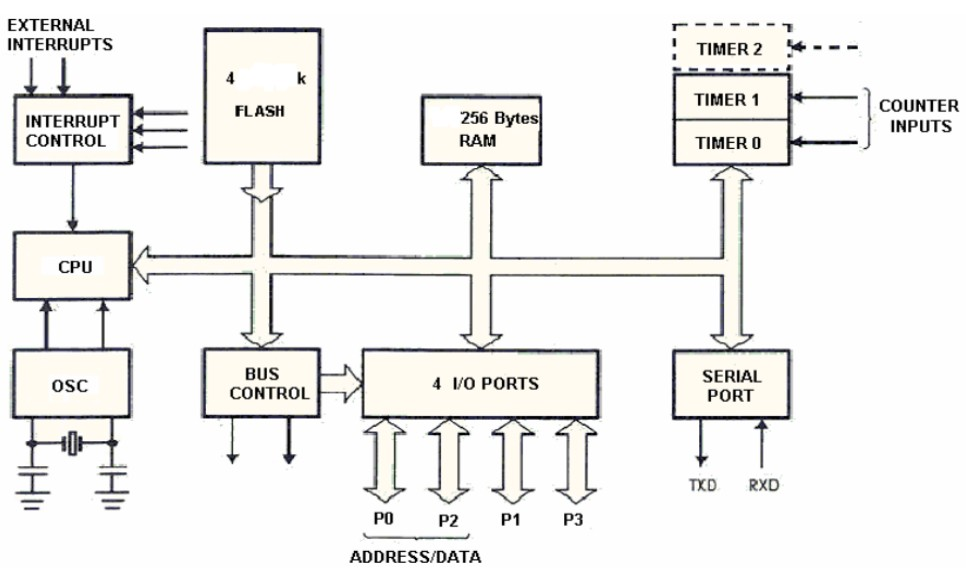

 # SEL0433 - APLICAÇÃO DE MICROPROCESSADORES

## Capitulo 2 - Microcontoladores e Revisão de Org. de Computadores

###  Atividade Semanal – Aula 2

 - NOME: Yuri Thadeu Oliveira Costa   
 - N° USP: 14754821

***
***

1 - Assinale V para verdadeiro e F para falso nas afirmações abaixo:

    (F) No modelo de Von Neumann, o microprocessador segue as instruções armazenadas na memória ROM (programas), lê as entradas e envia comandos sobre os canais de saída, alterando as informações contidas na memória RAM.
<!--
No modelo de Von Neumann, tanto as instruções quanto os dados são armazenados na mesma memória, geralmente RAM, e o microprocessador lê as instruções e dados dessa memória. Memoriam ROM geralmente é usada para o firmware.
-->
    (F) Os registradores Special Function Registers localizam-se sempre internos à CPU.
<!--
FAlso, podem ser encontrados na memoriam RAM também 
-->
    (F) O ciclo de máquina é composto pelo ciclo de busca mais o ciclo de execução cada qual demorando um pulso de clock.
<!--
O ciclo de máquina é composto pelo ciclo de busca (fetch) e o ciclo de execução (execute), mas cada um desses ciclos pode demorar mais de um pulso de clock, dependendo da complexidade da instrução e da arquitetura do processador. Portanto, a ideia de que cada um desses ciclos demora exatamente um pulso de clock não é correta.
-->
    (V) A instrução “CLR A” não possui operando e gasta apenas 1 ciclo de máquina
<!--
Verdadeiro, Vide slide 17
-->
    (V) A arquitetura Von Neumann é considerada uma arquitetura mais simples do que a arquitetura Harvard porque utiliza o mesmo barramento para o tráfego de dados e de instruções.
<!--
Verdadeiro, Vide slide 24
-->
    (V) A técnica de pipeline é impossível de ser utilizada em computadores de arquitetura Von Neumann.
<!--
Verdadeiro, Vide slide 26
-->

***

2 - Indique quais afirmativas se aplicam a uma instrução CISC e quais a uma instrução RISC:

- Os programas são mais complexos - **(CISC)**
- A maioria das instruções tem a mesma duração - **(RISC)**
- Mais instruções disponíveis - **(CISC)**
- Programas menores - **(CISC)**
- Utiliza menos espaço na memória de programa - **(RISC)**
- Processamento de cada instrução é mais lento - **(CISC)**
- Microcontroladores PIC, AVR, ARM - **(RISC)**
- Tempo de execução das instruções depende da frequência do clock. - **(CISC)**
***
 
3 - Abaixo é apresentado o diagrama de um microcontrolador. Qual a arquitetura utilizada e como chegamos a essa conclusão? Quantas portas I/O bidirecional e quantas linhas (bits/pinos) são endereçados de forma individual neste microcontrolador, com base neste diagrama?

 

    

 

    A arquitetura usada é a de Von Neumann pois, mesmo tendo duas memorias, elas apresentam somente um barramento. O microcontrolador tem 4 portas I/O bidirecionais e 32 pinos são usados para endereçamento individual do microcontolador dado que cada porta tem I/O tem 8 bits(portas). Além dessas 32 portas, temos mais 8 portas para controle e alimentação.

***
 
4 - Análise inicial das diferenças entre microcontroladores e microprocessadores.

- Escolha um microcontrolador entre as seguintes opções: 8051 (ex.: AT89C51); Arduino (AVR ATmega 328p).
- Escolha um microprocessador entre as seguintes opções: (Motorola 68000; Intel 80486, ADM K5, Intel Pentium).

Complete a tabela abaixo comparando os dispositivos escolhidos. Pesquisar e responder cada célula com palavra-chave e de forma objetiva. Pense em termos de desempenho, consumo de energia, custo, complexidade e exemplos de aplicação. O objetivo desta atividade não é responder certo ou errado, mas estimular a reflexão e pensamento a cerca das diferenças entre microcontroladores e microprocessadores.

| Critério|Microcontrolador (8051)|Microprocessador (Intel Pentium)|
|-                          |-                                  |-                                  |
| Arquitetura e conjunto de instruções | CISC                   | CISC                              |
| Foco                      | Sistemas embarcados               | Computadores pessoais             |
| Eficiência Energética     | Alta                              | Baixa                             |
| Complexidade e custo      | Baixa, baixo custo                | Alta, alto custo                  |
| Memória                   | Integrada                         | Externa                           |
| Impactos de uso           | Baixo consumo, menor desempenho   | Alto desempenho, maior consumo    |
| Aplicações                | Controle industrial, automação    | Computação geral, jogos           |
| Flexibilidade             | Menor flexibilidade               | Alta flexibilidade                |

 

***

 

Reflexão: Recorra ao exemplo do microcontrolador aplicado ao controle de um elevador que foi apresentado em aula, disponível nas transparências do Cap. 1. De acordo com seu ponto de vista, quais as vantagens de se utilizar um microcontrolador para aquele tipo de aplicação e qual deve ser o “perfil” de um microcontrolador ideal para aquela aplicação do elevador em termos de capacidade da CPU (baixa, média ou alta), quantidade de bits no barramento, e precisão no tratamento das informações (operação somente com inteiros ou ponto flutuante?)

    Utilizar um microcontrolador para o controle de um elevador pode trazer várias vantagens, como redução de custos, baixo consumo de energia, menor necessidade de manutenção e facilidade na implementação de lógicas complexas. Além disso, permite o monitoramento remoto e diagnósticos do sistema. O microcontrolador ideal para essa aplicação deve ter uma CPU de capacidade média, pois as operações são relativamente simples e não exigem alto desempenho. Um barramento de 8 ou 16 bits já deve ser considerado suficiente para garantir uma comunicação eficiente entre a CPU, a memória e os periféricos. Em relação à precisão no tratamento das informações, como foi dado no exemplo em sala o microcontrolador deve ter suporte operações em ponto flutuante para o controle preciso de temperatura e velocidade dos motores. Mesmo que tenham comentado sobre isso durante a aula, não me parece ser tão necessário, uma ULA simples que faz somente operações com inteiros já deve ser suficiente para esse tipo de aplicação.

***
<!--
COMENTÁRIOS E NOTAS IMPORTANTES SOBRE O CAPITULO

PORTA PARALELA: recebe somente zeros e uns (entrada binária) e é usada para controlar coisas que que recebem ou devolvem valores binários. Um exemplo seria um motor, que pode estar (1) ou não(0) ligado.

PORTA DIGITAL: Recebe valores variáveis no tempo, podendo ser do tipo inteiro ou de ponto flutuante. Um exemplo seria a analise de peso/temperatura em um elevador, esses valores variam de acordo com a quantidade de passageiros.

PORTA SERIAL: Manda/Recebe uma quantidade de bits de uma só vez, usando somente um pino. Um exemplo seria um teclado, quando digitamos uma tecla, cada uma delas manda um codigo binário para a porta, que pode ter uma quantidade de bits que depende dar arquitetura do microcontrolador, mas que será interpretado pelo Microprocessador.

-->