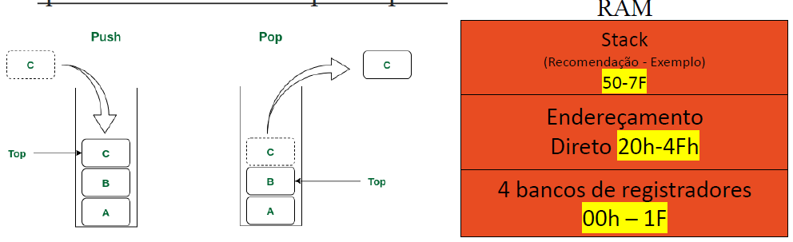
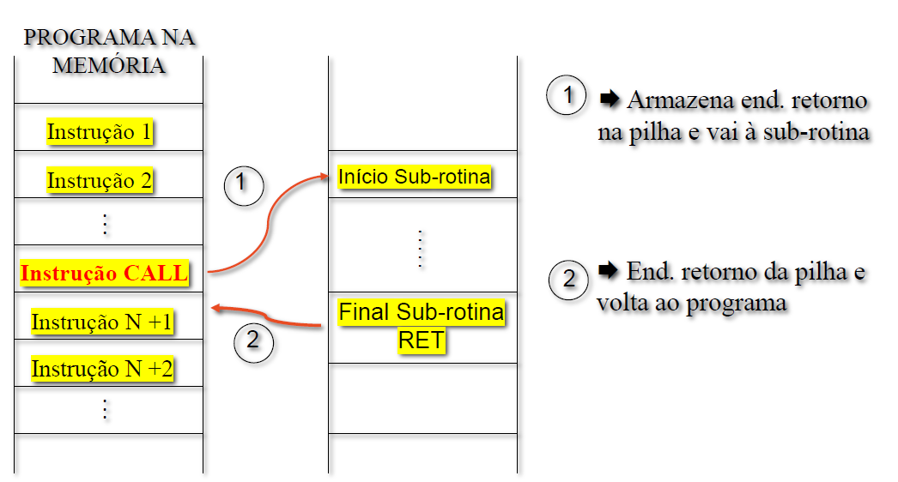
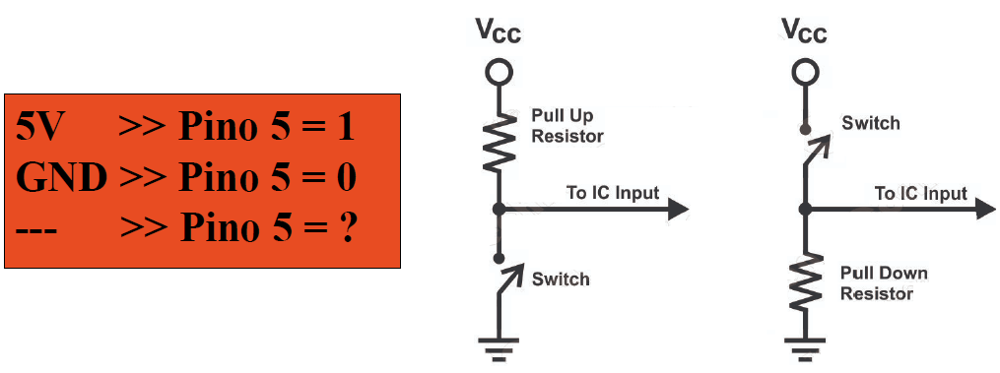
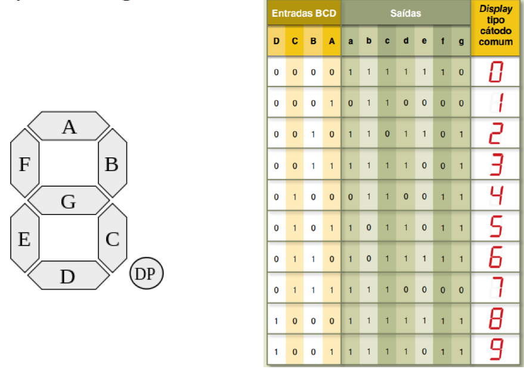

# Informações e Comentários sobre atividades

Este arquivo tem como objetivo reunir informações relevantes que fundamentaram as respostas das atividades, além de disponibilizar os links para os slides utilizados e incluir comentários considerados importantes sobre cada um deles.

**Nota:** A relevância dos comentários é inteiramente subjetiva e reflete a perspectiva e as prioridades do autor ([Yuri Thadeu](https://www.linkedin.com/in/yuri-thadeu-01/)).

***
***

## ATIVIDADE 1

Slide da aula [Neste Link](https://edisciplinas.usp.br/pluginfile.php/8786785/mod_resource/content/3/SEL0433_Cap1_Sistemas_Embarcados.pdf)

***
***

## ATIVIDADE 2

Slide da aula [Neste Link](https://edisciplinas.usp.br/pluginfile.php/8786790/mod_resource/content/6/SEL0433_Cap2_RevOrgComp_MCU_pdf.pdf)

- No modelo de Von Neumann, tanto as instruções quanto os dados são armazenados na mesma memória, geralmente RAM, e o microprocessador lê as instruções e dados dessa memória. Memoriam ROM geralmente é usada para o firmware;
- Os registradores Special Function Registers podem ser encontrados na RAM também;
- O ciclo de máquina é composto pelo ciclo de busca (fetch) e o ciclo de execução (execute), mas cada um desses ciclos pode demorar mais de um pulso de clock, dependendo da complexidade da instrução e da arquitetura do processador. Portanto, a ideia de que cada um desses ciclos demora exatamente um pulso de clock não é correta;
- A instrução “CLR A” não possui operando e gasta apenas 1 ciclo de máquina, vide slide 17;
- A arquitetura Von Neumann é considerada uma arquitetura mais simples do que a arquitetura Harvard porque utiliza o mesmo barramento para o tráfego de dados e de instruções, vide slide 24.;
-  A técnica de pipeline é impossível de ser utilizada em computadores de arquitetura Von Neumann, vide slide 26.

 

- Os programas são mais complexos - **(CISC)**
- A maioria das instruções tem a mesma duração - **(RISC)**
- Mais instruções disponíveis - **(CISC)**
- Programas menores - **(CISC)**
- Utiliza menos espaço na memória de programa - **(RISC)**
- Processamento de cada instrução é mais lento - **(CISC)**
- Microcontroladores PIC, AVR, ARM - **(RISC)**
- Tempo de execução das instruções depende da frequência do clock. - **(CISC)**
  
 

PORTA PARALELA: recebe somente zeros e uns (entrada binária) e é usada para controlar coisas que que recebem ou devolvem valores binários. Um exemplo seria um motor, que pode estar (1) ou não(0) ligado.

PORTA DIGITAL: Recebe valores variáveis no tempo, podendo ser do tipo inteiro ou de ponto flutuante. Um exemplo seria a analise de peso/temperatura em um elevador, esses valores variam de acordo com a quantidade de passageiros.

PORTA SERIAL: Manda/Recebe uma quantidade de bits de uma só vez, usando somente um pino. Um exemplo seria um teclado, quando digitamos uma tecla, cada uma delas manda um codigo binário para a porta, que pode ter uma quantidade de bits que depende dar arquitetura do microcontrolador, mas que será interpretado pelo Microprocessador.

***
***

## ATIVIDADE 3

Slide da aula [Neste Link](https://edisciplinas.usp.br/pluginfile.php/8788621/mod_resource/content/2/SEL0433_SEL0614_Cap3_Recursos.pdf)

Acesse o guia disponibilizado na [página do simulador EdSim51](http://www.edsim51.com/simInstructions.html) e confira os principais recursos da do programa.

***
***

## ATIVIDADE 4

Slide da aula [Neste Link](https://edisciplinas.usp.br/pluginfile.php/8788631/mod_resource/content/1/SEL0433_SEL0614_Cap4_Programação.pdf)

Ver as imagens img_atv4_1.png à img_atv4_5.png, retiradas do material Prof. Pedro Oliveira que foi apresentado na Atividade 3 para conseguir criar os codigos propostos.

Set competo de instruções do 8051 [Neste Link](https://www.win.tue.nl/~aeb/comp/8051/set8051.html)

***
***

## ATIVIDADE 5

Para fazer essa atividade foi necessário usar as informações tanto do Slide da aula 3 quando o da aula 4, além do Datasheet AT89S51 e do set completo de intruções do 8051.

### Observações Slide 3
#### SIGLAS IMPORTANTES: 

	RXD – receptor de dado serial;

	TXD – transmite dados seriais;

	PC (Contador de programa) - Armazena o endereço da próxima instrução a ser executada por um programa;

	DPTR (Data Pointer): ponteiro de 16 bits para área de dados em memória RAM interna e externa;

	SP (Stack Pointer): ponteiro de pilha (8 bits), determina a área da RAM interna dedicada à pilha;

#### MODOS DE ENDEREÇAMENTO

	- IMEDIATO: o dado é definido na própria na própria instrução, sendo precedido por #
		EX: MOV A, #0AAh ; A = 0AAh

	- POR REGISTRADOR: um registrador contém o dado
		EX: MOV 30h, R2; o dado de R2 é armazenado no endereço 30h
		ADD A, R3; o conteúdo de R3 é somado com A, e resultado em A

	- DIRETO: o dado é acessado pelo seu endereço
		EX: MOV R7, 4Ah; o dado de 4Ah da RAM é armazenado em R7

	- INDIRETO: somente R0 ou R1 (ponteiros), precedido por @ (endereço do dado)
		EX: MOV A, @R0; Se R0 = 42H (que contém C3H), o acumulador A recebe o valor C3H

	- ENDEREÇAMENTO POR BIT:
		EX: SETB 80h.1; seta o bit 1 do endereço 80h (Porta 0)
		CLR 80h.2 ; zera o bit 2 do endereço 80h (Porta 0)
		SETB RS1, CLR RS0 etc.

#### EXEMPLO DE ESCRITA E LEITURA (W/R) EM ASSEMBLY NO 8051

	WRITE -> Escrever nesses registradores altera o conteúdo nos pinos de saída do chip;
				MOV P1, #01h
	READ -> os registradores armazenam o estado presente nos pinos do chip na posição desejada;
				MOV A, P1

#### OBSERVAÇÕES IMPORTANTES:

	- Instruções da família MCS-51 (como o 8051) duram 12 ou 24 TCK (1 ou 2 Ciclos de máquina - CM), com exceção  MUL AB e DIV AB (usam 4 CM);
	- O 8051 tem um Cristal Oscilador de 12MHz, isso significa 12 milhões de ciclos por segundo.

### Observações Slide 4
JMP $; Trava o programa na linha onde temos essa condição

#### Pilha (Stack)
- A Pilha (Stack) é reservada geralmente para armazenamento de endereços de retorno de sub-rotina e interrupção;
- Ela pode ser usada para armazenar/ler dados temporários
sequenciais se necessário (instruções Push e Pop);
- No 8051: usa uma área da RAM (indicada por um ponteiro)
que deve ser reservada para a pilha.

	

 

 - Um dos usos mais importantes para as pilhas são as chamadas de sub-rotinas usando CALL e RET por exemplo.
   - CALL é uma instrução que solicita qua a proxima linha de execução ocorra no endereço de inicio de uma sub-rotina e que ela seja executada. Ela Guarda automaticamente o endereço de retorno da pilha (PC+1) antes de ir para a proxima rotina;
   - RET solicita o retorno ao programa principal (ultima instrução), resgatando da pilha o endereço de retorno e salva o regitrador PC (Program Counter).

	

 

#### Registrador Ponteiro de Pilha (Stack Pointer)
- É um registrador especial que funciona como um ponteiro de pilha;
- Ele indica o último endereço da pilha (armazena no topo da pilha) e é incrementao cada vez que é usado;
- O Stack Pointer (SP) é incrementado após uma instrução PUSS(enpilhar) ou CALL (sub-rotina);
- o SP é decrementado após uma instrução POP (desempilhar), RET ou RETI (retornos de subrotinas);

 

>**Erro: jamais deve-se saltar para uma sub-rotina com JMP!**

#### O papel dos resistores “Pull-up” e “Pull-down”

***Pull-up***: Manter o pino de entrada em **nível lógico 1 (VCC)** quando nada estiver conectado ao pino ou uma chave estiver aberta (circuito dreno). Ao pressionar a chave, o sinal **GND prevalecerá, colocando nível lógico 0 (0V) no pino**.

***Pull-down***: Manter o pino de entrada em **nível lógico 0 (0V – GND)**, quando a chave estiver aberta e nada estiver conectado ao pino (circuito fonte). Ao pressionar a chave, o sinal **VCC prevalecerá, colocando nível lógico 1 no pino**.

	

 

#### Display de 7 segmentos

	

 

#### OBSERVAÇÕES SOBRE AS QUESTÕES

	– Pilha é memória tipo LIFO (Last In First Out) ou FILO (First In Last Out), não FIFO.

	– A pilha guarda endereços de retorno de sub-rotinas e interrupções.

	– Stack Pointer aponta para endereço na RAM, não ROM.

	– As instruções PUSH e POP são exclusivas para pilha.

	– A instrução CALL não é usada para indicar desvio de interrupções. Para interrupções usa-se um vetor pré-definido específico (endereços fixos). CALL é usado apenas para chamar sub-rotinas diretamente.

	– RET carrega endereço da pilha no registrador PC, retomando a execução anterior.

	– O ponteiro SP é normalmente menor que o barramento de endereço da CPU. Por exemplo, em microcontroladores típicos como o 8051, SP é de 8 bits, mas o barramento de endereços pode ser maior (por exemplo, 16 bits). Além disso, SP não define a área da pilha, mas aponta a posição atual dela.

	– Memória da pilha é RAM, não composta diretamente por flip-flops tipo D. Flip-flops tipo D são usados diretamente em registradores internos, não na memória RAM da pilha.

Os códigos da atividade foram feito a partir dos modelos que estão no slide 4 nas paginas 36, 37 e 38.

***
***

## TRABALHO 1

***
***