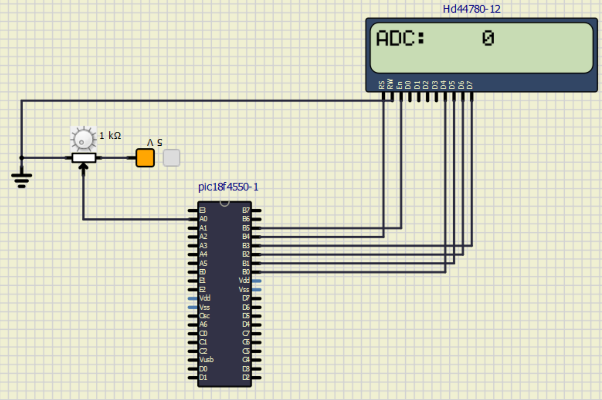
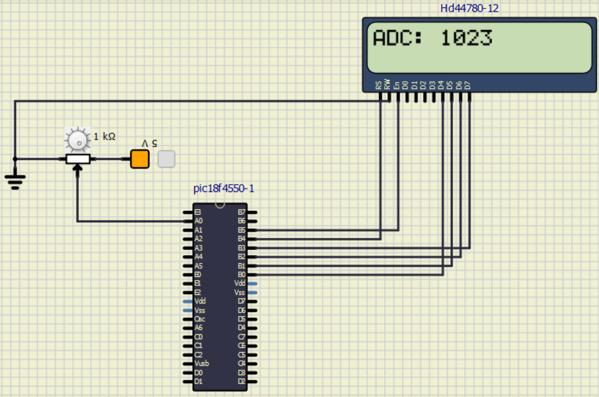
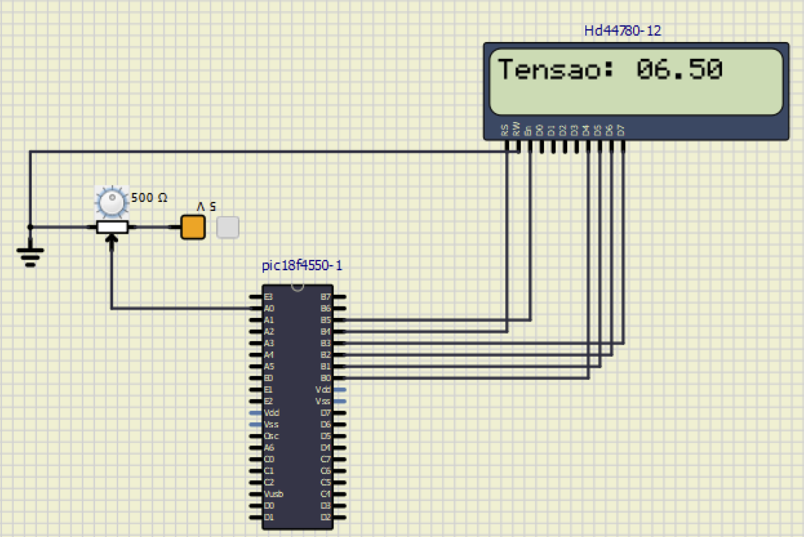
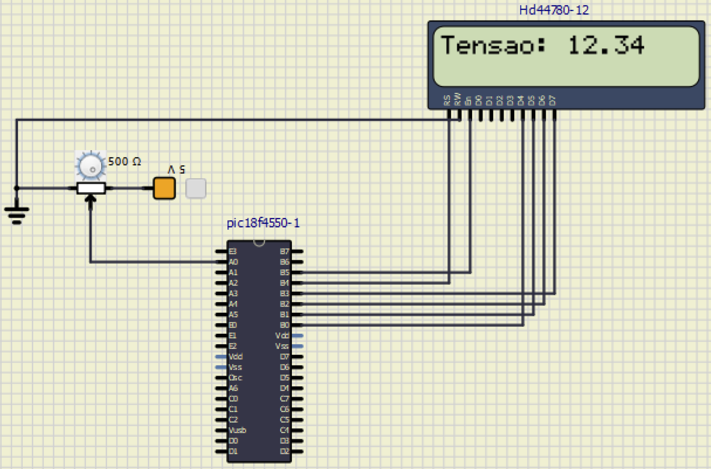

# SEL0433 - APLICAÇÃO DE MICROPROCESSADORES

## Capitulo 8 - Conversores A/D

### Atividade Semanal – Aula 9

- NOME: Yuri Thadeu Oliveira Costa
- N° USP: 14754821
  
***
***

### OBJETIVOS

O Objetivo dessa atividade é a programação do conversor analógico-digital e display LCD com especial atenção para os registradores envolvidos na configuração e nas bibliotecas do compilador que permitem otimização do código.

Parar essa pratica serão usados os códigos de exemplo de programas em linguagem C usados na aula (disponível no e-Disciplinas).

### Questão 1

Implementar no SimulIDE um programa para realizar a leitura analógica de um potenciômetro (Vref. 0-5V) utilizando o conversor A/D do PIC18F4550 (sem utilizar a biblioteca ADC do compilador – configurar os registradores ADCON0, ADCON1 e ADCON2) e exibir o valor digital (de 0 a 1023) em um display LCD. Montar no SimulIDE o circuito conectado um display LCD (ligar no modo 4 bits) ao PORTB (ou qualquer outro) no modo 4 bits. Conectar o potenciômetro no pino RA3 ou RA5 (apenas sugestão do canal analógico AN0 ou AN4, mas pode ser qualquer outro) do PIC18F4550. Ajustar o clock do microcontrolador para 8 MHz. Carregar o firmware (arquivo hex resultante da compilação no software MikroC PRO for PIC) e realizar a simulação.

```c
unsigned int LeituraADC;	// Variavel de leitura
char Texto [7];// Char que recebera o equivalente em texto

// Config dos pinos do LCD :
sbit LCD_RS at RB4_bit;
sbit LCD_EN at RB5_bit;
sbit LCD_D7 at RB3_bit;
sbit LCD_D6 at RB2_bit;
sbit LCD_D5 at RB1_bit;
sbit LCD_D4 at RB0_bit;
sbit LCD_RS_Direction at TRISB4_bit;
sbit LCD_EN_Direction at TRISB5_bit;
sbit LCD_D7_Direction at TRISB3_bit;
sbit LCD_D6_Direction at TRISB2_bit;
sbit LCD_D5_Direction at TRISB1_bit;
sbit LCD_D4_Direction at TRISB0_bit;

void main () {
	// Config dos pinos
	TRISA= 0xFF; // Pinos A como analogico
	TRISB= 0x00; // PORTB como saida LCD
	ADCON0= 0b00000001; // Canal AN0 selecionado, ADC ligado
	ADCON1= 0b00001110; // AN0 analogico
	ADCON2= 0b10101010; // 

	// Config do LCD
	Lcd_Init ();
	Lcd_Cmd (_LCD_CLEAR );
	Lcd_CMD (_LCD_CURSOR_OFF );
	Lcd_OUT (1,1,"ADC: "); // P/ mostrar no LCD
	while (1){
		ADCON0.GO_DONE=1; // Iniciando a conversao do ADC
		while (ADCON0.GO_DONE==1);
		LeituraADC= ((ADRESH<< 8)|ADRESL);
		WordToStr(LeituraADC,Texto );
		LCD_Out(1,5,Texto );
		Delay_ms(30);
		}
}
```

No exercício inicial, foi realizada a aquisição de dados de um potenciômetro ligado ao canal analógico AN0 do PIC18F4550. A configuração do conversor A/D foi feita manualmente com ajustes nos registradores ADCON0, ADCON1 e ADCON2, dispensando o uso de bibliotecas pré-configuradas do compilador. O teste no SimulIDE funcionou corretamente durante a simulação como seguem as imagems abaixo com os valores maximos e minimos mostrados.

<br>
<div style="text-align: center;">
    
    <p>Figura 1 - Valor mínimo lido no potenciômetro (0V).</p>
</div>
<br>

<br>
<div style="text-align: center;">
    
    <p>Figura 2 - Valor máximo lido no potenciômetro (5V).</p>
</div>
<br>


### Questão 2

Na questão dois, o proposito é repetir a implementação anterior realizando a mesma leitura a leitura analógica de um potenciômetro (Vref. 0-5V) utilizando o conversor A/D do PIC18F4550. Desta vez, no entanto, utilizar a biblioteca ADC do compilador MikroC PRO for PIC ao invés de configurar manualmente os registradores ADCON0, ADCON1 e ADCON2. Da mesma forma, utilizando a estratégia demonstrada em aula, formate os valores digitais para serem exibidos no display LCD em ponto flutuante (por exemplo: 12.34) sem utilizar variáveis do tipo float no programa.

```c
unsigned int LeituraADC;
char Tensao[6]; // recebe o equivalente em texto

// Config dos pinos do LCD:
sbit LCD_RS at RB4_bit;
sbit LCD_EN at RB5_bit;
sbit LCD_D7 at RB3_bit;
sbit LCD_D6 at RB2_bit;
sbit LCD_D5 at RB1_bit;
sbit LCD_D4 at RB0_bit;
sbit LCD_RS_Direction at TRISB4_bit;
sbit LCD_EN_Direction at TRISB5_bit;
sbit LCD_D7_Direction at TRISB3_bit;
sbit LCD_D6_Direction at TRISB2_bit;
sbit LCD_D5_Direction at TRISB1_bit;
sbit LCD_D4_Direction at TRISB0_bit;

void main(){
	// Config dos pinos
	TRISA= 0xFF; // Pinos A como entrada(analogica)
	TRISB= 0x00; // PORTB como saida(LCD)
	ADC_Init();  // Inicializacao do Modulo ADC via biblioteca

	// Config do LCD
	Lcd_Init();
	Lcd_Cmd(_LCD_CLEAR);
	Lcd_CMD(_LCD_CURSOR_OFF);
	Lcd_OUT(1,1,"Tensao: "); // Texto mostrado no LCD

	while(1){
		LeituraADC= ADC_Read(0); // funcao da biblioteca ADC do compilador para

		// lendo dos valores de 0 a 1023
		LeituraADC= LeituraADC*(1234/1023.); // formata o valor de entrada. nfloat max= 12.34

		// Formatando valores no display
		Tensao[0]= (LeituraADC/1000)+’0’;
		Tensao[1]= (LeituraADC/100)%10+’0’;
		Tensao[2]=  ’.’;
		Tensao[3]= (LeituraADC/10)%10+’0’;
		Tensao[4]= (LeituraADC/1)%10+’0’;
		Tensao[5]=  0;
		LCD_Out(1,9,Tensao);
		Delay_ms(30);
	}
}
```

No segundo exercício, repetiu-se a leitura analógica do potenciômetro, desta vez empregando a biblioteca ADC do compilador MikroC, o que facilitou o processo ao permitir a leitura direta do valor digital com a função ADC_Read(). Para exibir os dados no display, aplicou-se a estratégia sugerida na atividade e nos materiais de aula, utilizando uma formatação em ponto flutuante no formato "12.34", sem recorrer a variáveis do tipo float. A simulação feita no SimulIDE funcionou como esperado, sendo apresentados abaixo os registros de valores intermediários e o valor máximo medido.

<br>
<div style="text-align: center;">
    
    <p>Figura 1 - Leitura intermediária do potenciômetro (~6,5V).</p>
</div>
<br>

<br>
<div style="text-align: center;">
    
    <p>Figura 2 - Leitura próxima ao valor máximo do potenciômetro (~12,34V).</p>
</div>
<br>
