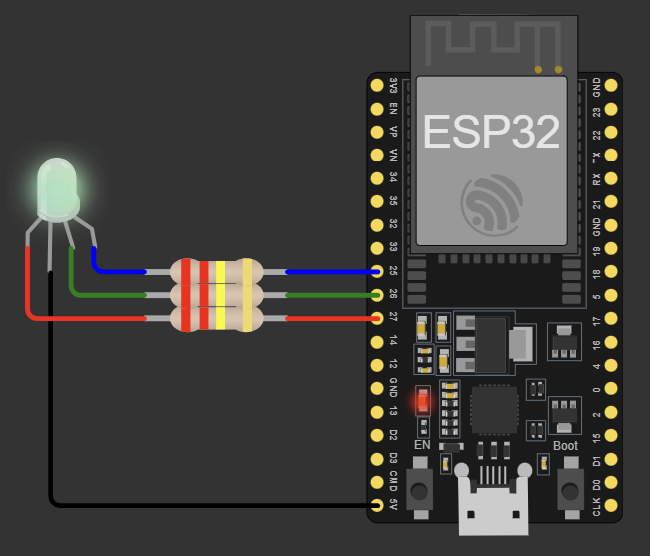
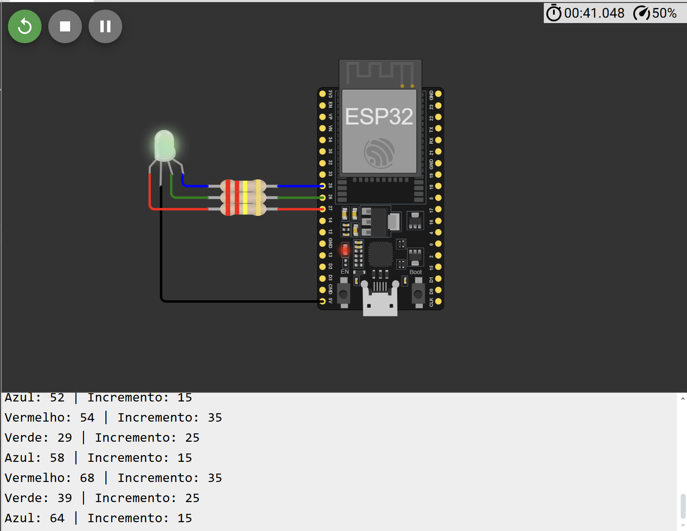
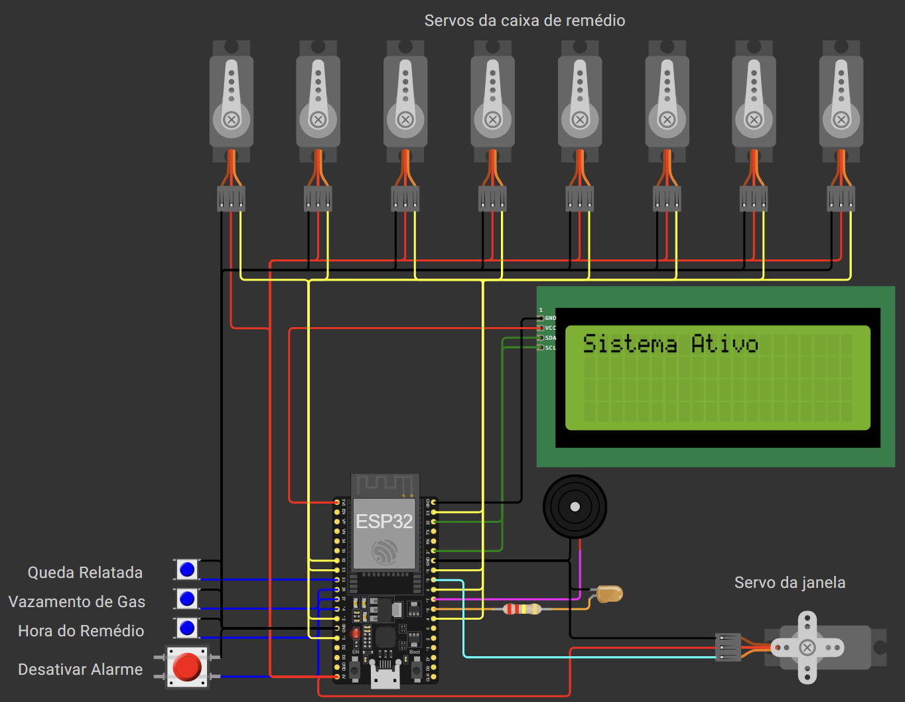
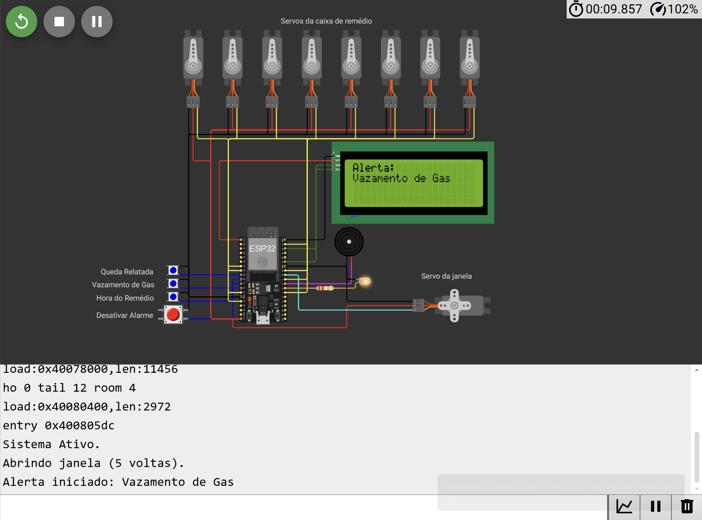

# SEL0433 - APLICAÇÃO DE MICROPROCESSADORES 

## Introdução aos Microcontroladores de 32 bits

## Projeto 4: Controle PWM e Comunicação

 - NOME: Yuri Thadeu Oliveira Costa
    - N° USP: 14754821
 - NOME: Heloisa Oliveira de Carvalho
    - N° USP: 13833960

***
***

### Objetivos

- Exercitar a programação em alto nível para microcontroladores de 32 bits
- Desenvolver um projeto prático com foco em comunicação serial e PWM (pulse width modulation).
- Usar bibliotecas otimizadas para programação de periféricos e controle de GPIO: UART, I2C, Display OLED, Touch, PWM, Wi-Fi e Bluetooth por meio da plataforma ESP32 Devkit e do ambiente de simulação virtual Wokwi.
- Reflexão sobre as decisões de projeto envolvendo escolha de microcontroladores, recursos de hardware e software, otimização energética e desafios de implementação.

### Requisitos do projeto

#### Parte 1 – Controle PWM de LED RGB

Implementar um projeto para controle PWM e comunicação serial utilizando a placa ESP32 Dev Module. Conectar um LED RGB (catodo comum) na GPIO da placa conforme esquemático ilustrado na Figura abaixo, utilizando resistores de 220 ohms. Programar utilizando bibliotecas do ESP32 por meio da Espressif IDE ou Arduino IDE ficando a critério do aluno qual framework usar. Com base na documentação e exemplos disponibilizados na página da biblioteca LED Control PWM (LEDC), elaborar um programa para realizar a modulação de brilho em um LED RGB utilizando a técnica PWM:

- O PWM deverá controlar o brilho individual de cada cor “ R- Red”, “G- Green” e “B- Blue” do LED, com resolução a partir de 8 bits (256 níveis) (pode ser escolhido uma resolução maior);

- Cada pino GPIO associado aos terminais R, G e B deve ser vinculado à um canal PWM individual da ESP32, utilizando a biblioteca LEDC (LED Control PWM).

- O duty cycle deve variar de 0 a 100% em loop, com frequência de 5kHz, com valor de incremento pré-definido (por exemplo: se definir o valor “5”, o controle/resolução do brilho será feito de 5 em 5, até 255, por exemplo).

- O valor de incremento será aplicado de forma individual e diferente a cada cor do LED RGB (por exemplo: R = incremento*2; G = incremento; B = incremento*3 – outra lógica poderá ser usada desde que o incremento seja aplicado com valores distintos em cada cor).

- Exibir uma mensagem no Monitor Serial/terminal (UART – baud: 115.200) que indique o valor de incremento e duty cycle.

- Elaborar e testar/simular o projeto no Wokwi (o qual dispõe de LED RGB). Pode-se também testar na placa física disponível no laboratório (o laboratório também dispõe de LED RGB, resistores, conectores e protoboard).

- Desafio proposto 1 (opcional - pontuação diferenciada): tentar implementar o controle do duty cycle de cada cor do LED RGB (ou escolher uma delas) via comunicação sem fio no programa. A implementação pode ser realizada por meio de um aplicativo de terminal Bluetooth comum disponível em smartphone, de forma a permitir que se envie valores numéricos que serão interpretados como incrementos para o duty cycle de cada canal (R, G, B) pelo programa por meio do módulo Bluetooth da ESP32. A implementação é opcional e faz parte do desafio que o/a aluno(a) estude por conta própria o uso de bibliotecas de comunicação serial Bluetooth com ESP32, a integração desse recurso ao programa base e a realização da interação prática via aplicativo de terminal no celular, visando explorar recursos mais avançados disponíveis em sistemas embarcados.
- O simulador Wokwi também oferece suporte a outras plataformas baseadas em microcontroladores de 32 bits, como a Raspberry Pi Pico e a STM32. O uso delas também é opcional e pode ser adotado como alternativa à ESP32 como um desafio adicional, a critério do aluno.

<b>Formato de entrega da Parte 1:</b> Apresentar em um documento o programa desenvolvido com as partes principais devidamente comentadas. Apresentar fotos da montagem/diagrama; prints do monitor serial.


#### Parte 2 – Aplicação final de escolha do(a) aluno(a)

A aplicação final deverá envolver o uso de controle PWM para o comando de um motor, podendo incluir controle de movimento, rotação, velocidade ou posicionamento em motores de passo, e servo, motor, entre outros. A escolha deve ser compatível com os itens disponíveis no Wokwi, permitindo que o projeto seja totalmente simulado neste aplicativo. O projeto deve ser diferente do programa de Servo Motor solicitado na Atividade Semanal 11. Outras funcionalidades e recursos podem ser implementados, a critério do aluno, considerando que se trata de um projeto final. Ou seja, o ideal é que sejam utilizados todos os recursos estudados ao longo do semestre, além de explorar componentes e funcionalidades disponíveis no Wokwi, como sensores (temperatura, acelerômetros etc.), atuadores, Buzzers, uso de interrupções de GPIO para botões (se pertinente), integração com outros módulos como temporizadores/contadores, ADC/DAC etc. Para a parte de controle PWM, recomenda-se tentar utilizar a biblioteca MCPWM (via Arduino ou IDE nativa). Além disso, é obrigatório incluir algum tipo de comunicação serial e exibição dos resultados. Por exemplo: Exibição em um display OLED (via comunicação serial I2C) e/ou apresentação de dados no monitor serial ou terminal via UART.

<b>Formato de Entrega da Parte 2:</b> Apresentar em documento o programa desenvolvido, destacando as principais partes do código devidamente comentadas. Incluir uma discussão textual explicando o projeto escolhido e os principais conceitos envolvidos, bibliotecas utilizadas, além de outros recursos eventualmente empregados (como sensores, interrupções, conversores ADC/DAC, timers etc.) explicando como e por que cada um foi utilizado. Apresentar o diagrama e fotos da montagem prática (microcontrolador e circuito montado no Wokwi), com prints da simulação realizada mostrando, por exemplo, valores no display, monitor serial etc. Por fim, incluir na documentação uma discussão sobre os seguintes aspectos:

- Justificativa da escolha e do uso adequado de recursos de hardware (por que seria necessário usar um microcontrolador de 32 bits; quais os impactos e diferenças em relação a um de 8 bits; quando ou não utilizar);
- Qual o impacto do consumo de energia e formas de otimização desse consumo em sistemas embarcados quando se considera microcontroladores de 32 bits.

#### Entrega final:

- Apresentar as Partes 1 e 2 em único arquivo PDF ou link para documentação em repositório no GitHub (enviar o link por meio de um arquivo).
- Enviar separadamente os códigos fonte dos programas desenvolvidos nas Partes 1 e 2. Os scripts podem ser enviados em arquivo compactado ou, caso escolher o GitHub para documentar o projeto, colocar os códigos diretamente no repositório, sendo opcional o envio separado pelo e-Disciplinas neste último caso (neste caso, enviar link para o repositório).
- Realizar o upload dos arquivos na respectiva tarefa atribuída no e-Disciplinas até a data especificada. A atividade poderá ser feita preferencialmente em duplas. Qualquer dúvida sobre o formato de envio ou sobre a implementação da atividade prática, entrar em contato com o professor ou monitores.

***
***

### RESULTADOS:

Uma observação importante é que o desenvolvimento tanto da parte 01 quanto da parte 02 foram totalmente feitos usando o extensões do VsCode (PlatFormIO) e o simulador Worki.

#### Parte 01 - Controle PWM de LED RGB

Descrição do Projeto
Neste projeto, foi implementada a modulação de brilho individual de um LED RGB de cátodo comum utilizando a placa ESP32. Cada cor (vermelho, verde e azul) foi conectada a um pino GPIO distinto e configurada para gerar um sinal que simula PWM.

O programa varia o brilho de cada cor em um loop contínuo, de 0% a 100%. Os incrementos aplicados ao brilho são diferentes para cada cor (vermelho: incr * 7, verde: incr * 5, azul: incr * 3), o que gera variações de brilho independentes. Ao atingir o valor máximo (255), o brilho de cada cor é reiniciado para zero, criando um efeito de ciclo contínuo. Durante a execução, os valores percentuais de brilho e os incrementos aplicados são exibidos no monitor serial, permitindo o acompanhamento em tempo real do controle.

O projeto foi simulado na plataforma Wokwi e demonstrou funcionalidade correta, validando a aplicação do controle de brilho do LED RGB com o ESP32.

##### Código Implementado

```cpp
// Projeto 04 - Parte 01 - Controle PWM de LED RGB
// Este código demonstra o controle de brilho de um LED RGB usando a função analogWrite no ESP32.

#include <Arduino.h> // Inclui a biblioteca padrão do Arduino, essencial para funções básicas do ESP32.

// Definição dos pinos GPIO conectados a cada cor do LED RGB.
// Um LED RGB comum possui terminais para Vermelho (R), Verde (G), Azul (B) e um Cátodo Comum (GND).
const int ledR = 27; // Pino GPIO para o LED Vermelho.
const int ledG = 26; // Pino GPIO para o LED Verde.
const int ledB = 25; // Pino GPIO para o LED Azul.

// Variável para o valor de incremento fixo.
// Este valor define o passo de aumento do brilho a cada iteração do loop.
const int incr = 5;

// Variáveis para armazenar o valor atual de brilho (duty cycle) de cada cor.
// O valor varia de 0 (desligado) a 255 (brilho máximo), correspondendo a uma resolução de 8 bits.
int atualR = 0; // Brilho atual do LED Vermelho.
int atualG = 0; // Brilho atual do LED Verde.
int atualB = 0; // Brilho atual do LED Azul.

void setup() {
  Serial.begin(115200); // Inicia a comunicação serial a uma taxa de 115200 bps.
                       // Usada para depuração e para exibir os valores de brilho no Monitor Serial.

  // Configura os pinos do LED como saída.
  // pinMode(pino, MODO) define a função de um pino (INPUT, OUTPUT, INPUT_PULLUP).
  pinMode(ledR, OUTPUT); // Define o pino do LED Vermelho como saída.
  pinMode(ledG, OUTPUT); // Define o pino do LED Verde como saída.
  pinMode(ledB, OUTPUT); // Define o pino do LED Azul como saída.

  Serial.println("Controle PWM RGB alternativo iniciado."); // Mensagem de inicialização no Monitor Serial.
}

void loop() {
  // Atualiza o valor de brilho para cada cor com incrementos distintos.
  // Isso cria um padrão de variação de brilho independente para cada cor.
  atualR += incr * 7; // Incrementa o brilho do LED Vermelho com um passo maior.
  atualG += incr * 5; // Incrementa o brilho do LED Verde com um passo intermediário.
  atualB += incr * 3; // Incrementa o brilho do LED Azul com um passo menor.

  // Verifica se o valor de brilho ultrapassou o máximo (255) e o reinicia para 0 se necessário.
  // Isso garante que o brilho varie em um ciclo contínuo (0-255-0).
  if (atualR > 255) atualR = 0;
  if (atualG > 255) atualG = 0;
  if (atualB > 255) atualB = 0;

  // Usa analogWrite para aplicar o valor de brilho (simulando PWM) nos pinos do LED.
  // analogWrite(pino, valor) define o duty cycle (0-255) para o pino especificado.
  // No ESP32, analogWrite é implementado usando o módulo LEDC, mas com uma interface mais simples.
  analogWrite(ledR, atualR); // Aplica o brilho atual ao LED Vermelho.
  analogWrite(ledG, atualG); // Aplica o brilho atual ao LED Verde.
  analogWrite(ledB, atualB); // Aplica o brilho atual ao LED Azul.

  // Exibe os valores de brilho (em porcentagem) e o incremento aplicado no Monitor Serial.
  Serial.print("Vermelho: ");
  Serial.print(atualR * 100 / 255); // Converte o valor de 0-255 para uma porcentagem de 0-100%.
  Serial.print(" | Incremento: ");
  Serial.println(incr * 7); // Exibe o incremento específico para o LED Vermelho.

  Serial.print("Verde: ");
  Serial.print(atualG * 100 / 255);
  Serial.print(" | Incremento: ");
  Serial.println(incr * 5); // Exibe o incremento específico para o LED Verde.

  Serial.print("Azul: ");
  Serial.print(atualB * 100 / 255);
  Serial.print(" | Incremento: ");
  Serial.println(incr * 3); // Exibe o incremento específico para o LED Azul.

  delay(100); // Pequeno atraso em milissegundos para controlar a velocidade das transições de brilho.
              // Um atraso menor resulta em transições mais rápidas, e vice-versa.
}
```

##### Imagens da Simulação no Wokwi

<br>
<div style="text-align: center;">
    
    <p>Figura 1: Circuito Funcional Parte 01 Controle PWM de LED RGB - Elaborado no Wokwi.</p>
</div>
<br>

<br>
<div style="text-align: center;">
    
    <p>Figura 2: Simulação mostrando o ESP32, o LED RGB e os resistores, junto com a saída do Monitor Serial - Elaborado no Wokwi.</p>
</div>
<br>

***
***

#### Parte 02 - Sistema de Monitoramento e Alerta

##### Descrição do Projeto

A ideia geral é criar um sistema de alarme e monitoramento assistivo para idosos e outros familiares, visando avisá-los sobre eventuais problemas e promover maior segurança, conforto e autonomia no dia a dia.

Especificamente, esta parte do projeto implementa um sistema de monitoramento e alerta residencial capaz de detectar e responder a três tipos de eventos críticos simulados: queda, vazamento de gás e a hora de tomar o remédio. Para isso, utiliza um microcontrolador ESP32, um display LCD para feedback visual, um LED e um buzzer para alertas sonoros e visuais. Além disso, incorpora servos motores para automatizar a abertura de uma janela, em caso de vazamento de gás e de compartimentos de remédios, para a medicação correta e na hora certa (ainda não será implementada a logica de horas nesse projeto).

A lógica de funcionamento prioriza alertas de maior gravidade (gás e queda), garantindo uma resposta imediata. O sistema também permite o desligamento manual dos alertas e, no caso do alerta de remédio, aciona servos específicos para abrir os compartimentos de medicamentos indicados por um bitmap configurável. 

##### Código Implementado

```c

// Projeto 04 - Parte 02 - Sistema de Monitoramento e Alerta Residencial
// Este código implementa um sistema de alerta com detecção de eventos e atuação de periféricos.

#include <Wire.h>              // Biblioteca para comunicação I2C, necessária para interagir com o display LCD.
#include <LiquidCrystal_I2C.h> // Biblioteca específica para controlar displays LCD que utilizam o protocolo I2C.
#include <ESP32Servo.h>        // Biblioteca para controle de servos motores no ESP32, otimizada para seus timers.

// 🔷 Definições de Pinos de Saída
#define LED_PIN      16        // Pino GPIO para o LED indicador de alerta.
#define BUZZER_PIN   17        // Pino GPIO para o buzzer, responsável pelos alertas sonoros.

// 🔷 Definições de Botões de Entrada
// Os botões são configurados com pull-up interno para simplificar a fiação (não requer resistores externos).
#define BTN_QUEDA    25        // Botão que simula a detecção de uma queda.
#define BTN_GAS      26        // Botão que simula a detecção de vazamento de gás.
#define BTN_REMEDIO  27        // Botão que simula a hora de tomar o remédio.
#define BTN_DESLIGAR 14        // Botão para desativar o alarme ativo.

// 🔷 Definições de Pinos e Quantidades para Servos
#define SERVO_JANELA_PIN 18    // Pino GPIO para o servo motor que controla a abertura da janela.
#define NUM_CAIXAS 8          // Quantidade de compartimentos de remédios, cada um com um servo dedicado.

// 🔷 Inicialização do Objeto LCD
// lcd(endereço_I2C, colunas, linhas) - 0x27 é um endereço comum para módulos I2C LCD.
LiquidCrystal_I2C lcd(0x27, 16, 2);

// 🔷 Declaração de Objetos Servo
Servo servosCaixa[NUM_CAIXAS];   // Array de objetos Servo para controlar os 8 compartimentos de remédios.
Servo servoJanela;               // Objeto Servo para controlar a janela.

// 🔷 Mapeamento dos Pinos dos Servos das Caixas
// Este array define os pinos GPIO aos quais cada um dos 8 servos das caixas está conectado.
int pinosCaixas[NUM_CAIXAS] = {
  4, 5, 12, 13, 19, 23, 32, 33
};

// 🔷 Enumeração para os Tipos de Alerta
// Define os possíveis estados de alerta, com valores numéricos para priorização (NENHUM < REMEDIO < GAS < QUEDA).
enum Alerta {
  NENHUM = 0,    // Nenhum alerta ativo.
  REMEDIO = 1,   // Alerta de hora do remédio.
  GAS = 2,       // Alerta de vazamento de gás (prioridade média).
  QUEDA = 3      // Alerta de queda (prioridade alta).
};

Alerta alertaAtivo = NENHUM;    // Variável global que armazena o tipo de alerta atualmente ativo.
String end_caixa = "01101001";  // Bitmap (string binária) indicando quais caixas de remédios devem ser abertas.
                                // '1' significa abrir, '0' significa manter fechada.

void setup() {
  Serial.begin(115200);          // Inicializa a comunicação serial para depuração.

  pinMode(LED_PIN, OUTPUT);      // Configura o pino do LED como saída.
  pinMode(BUZZER_PIN, OUTPUT);   // Configura o pino do buzzer como saída.

  // Configura os pinos dos botões como entradas com pull-up interno.
  // INPUT_PULLUP garante que o pino esteja em HIGH por padrão, e LOW quando o botão é pressionado.
  pinMode(BTN_QUEDA, INPUT_PULLUP);
  pinMode(BTN_GAS, INPUT_PULLUP);
  pinMode(BTN_REMEDIO, INPUT_PULLUP);
  pinMode(BTN_DESLIGAR, INPUT_PULLUP);

  // Inicializa o display LCD.
  lcd.init();      // Inicializa o módulo LCD.
  lcd.backlight(); // Liga a luz de fundo do LCD.
  lcd.clear();     // Limpa o conteúdo do display.

  // Inicializa os 8 servos das caixas de remédios.
  // O loop percorre o array 'pinosCaixas' e anexa cada servo ao seu respectivo pino.
  for (int i = 0; i < NUM_CAIXAS; i++) {
    servosCaixa[i].attach(pinosCaixas[i]);
    servosCaixa[i].write(0); // Garante que os servos comecem na posição inicial (fechados).
  }

  servoJanela.attach(SERVO_JANELA_PIN); // Inicializa o servo da janela.
  servoJanela.write(0); // Garante que o servo da janela comece na posição inicial (fechada).

  Serial.println("Sistema Ativo."); // Mensagem de inicialização no Monitor Serial.
  lcd.setCursor(0, 0);             // Define o cursor na primeira coluna, primeira linha.
  lcd.print("Sistema Ativo");      // Exibe a mensagem de sistema ativo no LCD.
}

void loop() {
  // Checa o botão de gás. Este alerta tem prioridade e abre a janela imediatamente.
  if (digitalRead(BTN_GAS) == LOW) { // Se o botão de gás for pressionado (estado LOW devido ao pull-up).
    abrirJanela();                   // Abre a janela, independentemente de outros alertas.
    if (alertaAtivo < GAS) {         // Se o alerta ativo atual tiver menor prioridade que o de GÁS.
      iniciarAlerta(GAS);            // Inicia o alerta de gás.
    }
  }

  // Checa o botão de queda. Este alerta tem a maior prioridade.
  if (digitalRead(BTN_QUEDA) == LOW) { // Se o botão de queda for pressionado.
    if (alertaAtivo < QUEDA) {         // Se o alerta ativo atual tiver menor prioridade que o de QUEDA.
      iniciarAlerta(QUEDA);            // Inicia o alerta de queda.
    }
  }
  // Checa o botão de remédio. Este alerta tem a menor prioridade.
  else if (digitalRead(BTN_REMEDIO) == LOW) { // Se o botão de remédio for pressionado.
    if (alertaAtivo < REMEDIO) {            // Se o alerta ativo atual tiver menor prioridade que o de REMÉDIO.
      iniciarAlerta(REMEDIO);               // Inicia o alerta de remédio.
    }
  }

  // Se algum alerta está ativo (diferente de NENHUM), executa as ações visuais e sonoras.
  if (alertaAtivo != NENHUM) {
    executarAlerta(alertaAtivo); // Chama a função para executar o padrão de som/luz do alerta ativo.

    // Verifica o botão de desligar para encerrar o alerta.
    if (digitalRead(BTN_DESLIGAR) == LOW) { // Se o botão de desligar for pressionado.
      pararAlerta();                       // Chama a função para parar o alerta.
    }
  }
}

// ----------------------------------------------------------
// Funções Auxiliares do Sistema de Alerta
// ----------------------------------------------------------

// Inicia um novo alerta, atualizando o LCD e o Monitor Serial com a mensagem correspondente.
void iniciarAlerta(Alerta tipo) {
  alertaAtivo = tipo; // Define o tipo de alerta ativo.

  lcd.clear();        // Limpa o display LCD.
  lcd.setCursor(0, 0); // Posiciona o cursor.
  lcd.print("Alerta: "); // Exibe a mensagem "Alerta: ".
  lcd.setCursor(0, 1); // Posiciona o cursor na segunda linha.
  lcd.print(alertaToString(tipo)); // Exibe o nome do alerta (ex: "Queda Relatada").

  Serial.print("Alerta iniciado: "); // Exibe a mensagem no Monitor Serial.
  Serial.println(alertaToString(tipo));
}

// Executa os padrões de som (buzzer) e luz (LED) de acordo com o tipo de alerta.
void executarAlerta(Alerta tipo) {
  switch (tipo) {
    case QUEDA: // Padrão para alerta de queda: som e luz intermitentes mais lentos.
      tone(BUZZER_PIN, 1000);        // Emite um tom de 1000 Hz no buzzer.
      digitalWrite(LED_PIN, HIGH);   // Liga o LED.
      delay(500);                    // Espera 500 milissegundos.
      noTone(BUZZER_PIN);            // Para o tom do buzzer.
      digitalWrite(LED_PIN, LOW);    // Desliga o LED.
      delay(500);                    // Espera 500 milissegundos.
      break;

    case GAS: // Padrão para alerta de gás: som e luz intermitentes mais rápidos.
      tone(BUZZER_PIN, 2000);        // Emite um tom de 2000 Hz.
      digitalWrite(LED_PIN, HIGH);   // Liga o LED.
      delay(100);                    // Espera 100 milissegundos.
      noTone(BUZZER_PIN);            // Para o tom.
      digitalWrite(LED_PIN, LOW);    // Desliga o LED.
      delay(100);                    // Espera 100 milissegundos.
      break;

    case REMEDIO: // Padrão para alerta de remédio: sequência de bips curtos.
      for (int j = 0; j < 2; j++) { // Repete a sequência 2 vezes.
        for (int i = 0; i < 3; i++) { // Emite 3 bips curtos.
          tone(BUZZER_PIN, 1500);      // Emite um tom de 1500 Hz.
          digitalWrite(LED_PIN, HIGH); // Liga o LED.
          delay(200);                  // Espera 200 milissegundos.
          noTone(BUZZER_PIN);          // Para o tom.
          digitalWrite(LED_PIN, LOW);  // Desliga o LED.
          delay(200);                  // Espera 200 milissegundos.
        }
        delay(1000); // Pausa de 1 segundo entre as sequências de 3 bips.
      }
      break;

    default: // Caso nenhum tipo de alerta seja reconhecido (não deve ocorrer com a enumeração).
      break;
  }
}

// Para o alerta ativo, desliga LED e buzzer, e abre as caixas de remédios se o alerta for de REMEDIO.
void pararAlerta() {
  Serial.println("Alerta encerrado."); // Mensagem no Monitor Serial.
  lcd.clear();                        // Limpa o LCD.
  lcd.print("Alerta parado");         // Exibe mensagem no LCD.

  digitalWrite(LED_PIN, LOW);         // Garante que o LED esteja desligado.
  noTone(BUZZER_PIN);                 // Garante que o buzzer esteja desligado.

  if (alertaAtivo == REMEDIO) {       // Se o alerta que foi parado era de remédio.
    abrirCaixasSelecionadas();        // Chama a função para abrir as caixas indicadas.
  }

  alertaAtivo = NENHUM;               // Reseta a variável de alerta ativo para NENHUM.

  delay(2000);                        // Espera 2 segundos para a mensagem "Alerta parado".
  lcd.clear();                        // Limpa o LCD novamente.
  lcd.print("Sistema ativado");       // Exibe mensagem de sistema ativo.
}

// Percorre a string 'end_caixa' (bitmap) e aciona os servos das caixas indicadas por '1'.
void abrirCaixasSelecionadas() {
  Serial.print("Abrindo caixas: ");
  for (int i = 0; i < NUM_CAIXAS; i++) { // Itera por todos os 8 compartimentos.
    int bitPos = NUM_CAIXAS - 1 - i;    // Calcula a posição do bit (do mais significativo para o menos).
    if (end_caixa.charAt(bitPos) == '1') { // Se o bit na posição atual for '1'.
      Serial.print(i);                  // Exibe o número da caixa no serial.
      Serial.print(" ");
      servosCaixa[i].write(90);         // Gira o servo da caixa para 90 graus (posição de abertura).
      delay(1000);                      // Espera 1 segundo para o servo abrir.
      servosCaixa[i].write(0);          // Gira o servo de volta para 0 graus (posição de fechamento).
    }
  }
  Serial.println(); // Nova linha no Monitor Serial após listar as caixas abertas.
}

// Abre a janela simulando 5 voltas do servo da cortina.
void abrirJanela() {
  Serial.println("Abrindo janela (5 voltas).");
  for (int i = 0; i < 5; i++) { // Loop para simular 5 "voltas" ou ciclos de abertura/fechamento.
    servoJanela.write(180);     // Gira o servo para 180 graus (uma extremidade).
    delay(500);                 // Espera 500 milissegundos.
    servoJanela.write(0);       // Gira o servo de volta para 0 graus (outra extremidade).
    delay(500);                 // Espera 500 milissegundos.
  }
}

// Retorna uma string descritiva para cada tipo de alerta.
String alertaToString(Alerta tipo) {
  switch (tipo) {
    case QUEDA: return "Queda Relatada";     // Retorna a string para alerta de queda.
    case GAS: return "Vazamento de Gas";     // Retorna a string para alerta de gás.
    case REMEDIO: return "Hora do Remedio";  // Retorna a string para alerta de remédio.
    default: return "Nenhum";                // Retorna "Nenhum" caso não haja alerta ou tipo desconhecido.
  }
}
```


<br>
<div style="text-align: center;">
    
    <p>Figura 3: Diagrama de circuito do sistema de monitoramento e alerta implementado no Wokwi, mostrando o ESP32 conectado ao LCD, botões, LED, buzzer e servos motores.</p>
</div>
<br>

<br>
<div style="text-align: center;">
    
    <p>Figura 4: Simulação do sistema no Wokwi com o alerta de vazamento de gás ativado, indicando a abertura da janela no display LCD e no servo.
</p>
</div>
<br>

<br>
<div style="text-align: center;">
    
    <p>Figura 5: Simulação do sistema no Wokwi com o alerta de hora do remédio ativado, mostrando as caixas de remédios sendo abertas pelos servos conforme o bitmap configurado.</p>
</div>
<br>